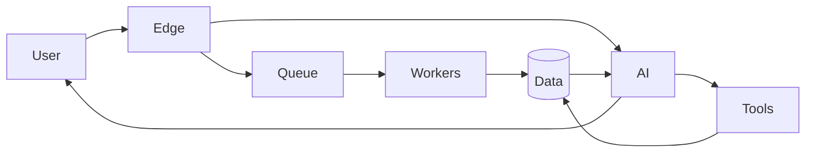

<div align="center">

# Building software that thinks, scales and ships.

**AI Systems · Product Engineering · Architecture · Infrastructure**

<br>

[](https://github.com/JesusGautamah)
&nbsp;

&nbsp;


</div>

---

<table>
<tr>
<td width="55%" valign="top">

### Hello.

This is my **professional GitHub profile** — the place where I build, experiment and ship production software.

My work sits mostly at the intersection of:

- Artificial Intelligence
- Distributed systems
- Product architecture
- Backend engineering
- Cloud infrastructure
- Automation
- Developer tooling

I care about turning complex systems into products that feel simple.

</td>

<td width="45%" valign="top">

```txt
SYSTEM
──────────────────────────────

role        CTO / Engineer
mode        building
focus       AI Systems
platform    Linux
editor      LunarVim

status      ● operational
coffee      ● probably
```

</td>
</tr>
</table>

<br>

## Currently building

<table>
<tr>
<td align="center" width="25%">

### ◉ AI Agents

Conversational systems that actually interact with real business infrastructure.

</td>
<td align="center" width="25%">

### ◈ Platforms

Multi-tenant products, APIs and internal platforms designed to scale.

</td>
<td align="center" width="25%">

### ⬡ Infrastructure

Edge computing, queues, databases, workers and distributed workloads.

</td>
<td align="center" width="25%">

### ◇ Experiments

Rust, protocols, automation, AI tooling and ideas that probably started at 2 AM.

</td>
</tr>
</table>

<br>

## My stack

<div align="center">

### Core


### Product


### Infrastructure


</div>

<br>

## Engineering philosophy

```text
01  Simple interfaces.
02  Strong boundaries.
03  Observable systems.
04  Automate boring things.
05  Measure before optimizing.
06  Architecture should serve the product.
07  AI is a component — not the architecture.
```

<br>

## `~/workspace`

```bash
$ ls

ai-agents/
distributed-systems/
experiments/
infrastructure/
products/
protocols/
things-that-should-have-been-a-weekend-project/
```

```bash
$ cat philosophy.txt

Build → Measure → Break → Understand → Rebuild → Ship
```

<br>

## Things I find interesting

<table>
<tr>
<td>

**AI Engineering**

Agents  
Tool calling  
Context engineering  
Model routing  
Evaluation  
Structured outputs  

</td>
<td>

**Systems**

Queues  
Caching  
Workers  
Realtime systems  
Event-driven architecture  
Multi-tenancy  

</td>
<td>

**Low-level curiosity**

Rust  
Protocols  
Networking  
Binary formats  
Performance  
Linux  

</td>
<td>

**Product**

Architecture  
Developer Experience  
Automation  
SaaS  
Experimentation  
Shipping  

</td>
</tr>
</table>

<br>

## Architecture > hype

I like AI, but I'm even more interested in the systems around it.



<sub>
Good AI products are usually a combination of good models, good data and boring infrastructure that works.
</sub>

<br>

## A tiny control panel

| System | Status |
|---|---|
| `curiosity` | 🟢 online |
| `building_things` | 🟢 online |
| `breaking_things` | 🟢 online |
| `fixing_what_i_broke` | 🟡 processing |
| `meetings` | 🔴 rate limited |
| `coffee` | 🟢 healthy |

<br>

<details>
<summary><b>◉ Open developer console</b></summary>

<br>

```js
const developer = {
  role: ["CTO", "Engineer", "Builder"],

  interestedIn: [
    "AI",
    "distributed systems",
    "product architecture",
    "developer tools",
    "weird technical ideas"
  ],

  prefers: {
    operatingSystem: "Linux",
    architecture: "simple > clever",
    infrastructure: "observable",
    software: "useful",
  },

  currentState: "shipping"
};
```

</details>

<br>

---

<div align="center">

### This is my work profile.

For personal projects, experiments and open-source work:

### → [github.com/JesusGautamah](https://github.com/JesusGautamah)

<br>

<sub>Build useful things. Keep the interesting parts interesting.</sub>

<br><br>

<span>🔵</span>
<span>🔴</span>
<span>🟡</span>
<span>🟢</span>

</div>
